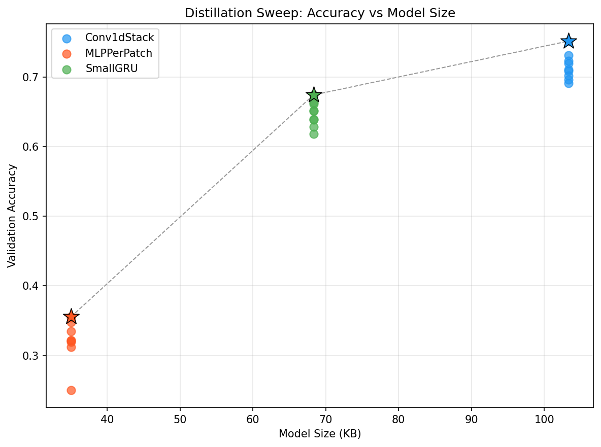

# Circadia

Personalized sleep health through on-device ML. Circadia fine-tunes the [SleepFM](https://github.com/zou-group/sleepfm-clinical) foundation model (published in *Nature Medicine*, trained on 585K+ hours of PSG data) on Sleep-EDF, distills it into tiny student models (8K–26K params), and deploys them to edge devices for real-time sleep staging. A gamified biofeedback frontend guides users through resonant breathing exercises to improve sleep quality.

## Pipeline overview

```
Raw EDF files (Sleep-EDF)
    ↓  preprocess.py — resample 100→128 Hz, z-score, embed via SetTransformer
HDF5 embeddings + CSV labels
    ↓  train.py — fine-tune SleepEventLSTMClassifier (2.7M params)
Teacher checkpoint
    ↓  soft_labels.py — cache teacher logits per subject
    ↓  train_distill.py — 27-config sweep (3 archs × 3 temps × 3 alphas)
Best student models (8K–26K params)
    ↓  export.py — ONNX (opset 11) + TorchScript
On-device inference (Jetson TK1 / Android)
```

## Setup

1. Install [uv](https://docs.astral.sh/uv/getting-started/installation/)
2. Clone and install:
   ```sh
   git clone --recurse-submodules <repo-url>
   cd circadia
   uv venv && uv sync
   source .venv/bin/activate
   ```

## Data

1. Download the Sleep-EDF Expanded dataset (SC subjects) from [PhysioNet](https://physionet.org/content/sleep-edfx/1.0.0/) and place the `.edf` files in `data/`:
   ```
   data/
   ├── SC4001E0-PSG.edf
   ├── SC4001EC-Hypnogram.edf
   ├── SC4002E0-PSG.edf
   ├── SC4002EC-Hypnogram.edf
   └── ...
   ```

2. Run preprocessing to generate embeddings and labels in `data/processed/`:
   ```sh
   uv run python -m src.preprocess
   ```
   This reads 5 channels (2x EEG, EOG, respiration, EMG), resamples to 128 Hz, z-score normalizes, maps to SleepFM's 23-channel layout, and embeds via SetTransformer into 128-dim tokens.

## Teacher fine-tuning

Train on [Modal](https://modal.com/) (requires `modal token set`):

```sh
uv run modal run src/modal_app.py
```

Or train locally:

```sh
uv run python -m src.train
```

Outputs the fine-tuned `SleepEventLSTMClassifier` (~2.7M params) to `checkpoints/sleepfm-sleepEDF/best.pth`. Training uses windowed slicing (100-epoch windows, 50% overlap), minority-class oversampling, and masked cross-entropy with inverse-frequency class weights.

## Knowledge distillation

The teacher is too large for edge devices like the NVIDIA Jetson TK1 (2 GB shared RAM, 192 Kepler CUDA cores). The distillation pipeline compresses it into tiny student models using soft-label knowledge distillation.

### Student architectures

| Architecture | Params | Size | Description |
|---|---|---|---|
| Conv1dStack | ~26K | ~104KB | Conv1d(128→32, k=5) → Conv1d(32→32, k=5) → Conv1d(32→5, k=1) |
| SmallGRU | ~17K | ~68KB | Linear(128→48) → GRU(48, hidden=24, bidir) → Linear(48→5) |
| MLPPerPatch | ~8.6K | ~35KB | Linear(128→64) → ReLU → Linear(64→5) + AvgPool1d(k=3) smoothing |

### Distillation loss

```
L = α · KL(softmax(student/T), softmax(teacher/T)) · T² + (1−α) · CE(student, hard_labels)
```

Sweep: 3 architectures × 3 temperatures (T ∈ {2, 4, 8}) × 3 alphas (α ∈ {0.3, 0.5, 0.7}) = 27 experiments.

### Results

**Pareto frontier (accuracy vs model size):**



Stars mark the Pareto-optimal model for each architecture.

**Pareto-optimal models:**

| Architecture | T | α | Accuracy | Size | Est. Latency (TK1) |
|---|---|---|---|---|---|
| Conv1dStack | 2 | 0.3 | **75.2%** | 103KB | 0.19ms |
| SmallGRU | 8 | 0.3 | **67.4%** | 68KB | 0.12ms |
| MLPPerPatch | 8 | 0.7 | **35.6%** | 35KB | 0.06ms |

All Pareto-optimal models fit on the Jetson TK1 with sub-millisecond inference. Lower alpha (more weight on KL divergence from teacher) generally performs better.

### Run distillation

**Locally (step by step):**

```sh
uv run python -m src.distill.soft_labels      # 1. Cache teacher logits
uv run python -m src.distill.train_distill     # 2. 27-experiment sweep
uv run python -m src.distill.export            # 3. Export to ONNX + TorchScript
uv run python -m src.distill.report            # 4. Pareto frontier plot
```

**On Modal (full pipeline):**

```sh
uv run modal run src/modal_distill.py
```

### Export & deployment

**Benchmark on device:**

```sh
python scripts/benchmark_jetson.py --model best_model.pt --format torchscript
python scripts/benchmark_jetson.py --model best_model.onnx --format onnx
```

**Upload to Hugging Face:**

```sh
uv run python -m src.distill.upload_hf --repo-id YOUR_USERNAME/circadia-sleep-student --dry-run
uv run python -m src.distill.upload_hf --repo-id YOUR_USERNAME/circadia-sleep-student
```

If exported files aren't local, pull from Modal volume first:

```sh
modal volume get circadia-data checkpoints/distill/Conv1dStack_T2_a0.3.onnx checkpoints/distill/
modal volume get circadia-data checkpoints/distill/Conv1dStack_T2_a0.3.pt checkpoints/distill/
```

**Outputs:**
- `checkpoints/distill/sweep_results.json` — metrics for all 27 experiments
- `checkpoints/distill/pareto.png` — Pareto frontier plot
- `checkpoints/distill/<arch>_T<t>_a<a>.onnx` / `.pt` — exported models

## Frontend

The `frontend/` directory contains a React/TypeScript app (Vite + Tailwind + Radix UI) for gamified sleep biofeedback. Users practice resonant breathing (0.1 Hz / ~6 breaths/min) through rhythmic tapping/swiping synchronized with visual cues, which boosts vagal tone and reduces sympathetic arousal to improve sleep quality.

Built with Three.js for 3D visualization, Framer Motion for animations, and Recharts for sleep data display.

## Project structure

```
src/
├── preprocess.py              # EDF → SetTransformer embeddings → HDF5 + CSV
├── dataset.py                 # SleepEDFDataset (windowed, oversampled, augmented)
├── augment.py                 # Temporal jitter, Gaussian noise, channel masking
├── channel_map.py             # Sleep-EDF 5ch → SleepFM 23ch mapping
├── train.py                   # Teacher fine-tuning (SleepEventLSTMClassifier)
├── evaluate.py                # Accuracy, confusion matrix, sleep quality score
├── modal_app.py               # Modal runner for teacher training
├── modal_distill.py           # Modal runner for distillation pipeline
├── config.yaml                # Teacher training config
├── distill/
│   ├── student_models.py      # SmallGRU, Conv1dStack, MLPPerPatch
│   ├── soft_labels.py         # Teacher inference → cached .npy logits
│   ├── dataset_distill.py     # DistillSleepEDFDataset + collate_fn
│   ├── train_distill.py       # Distillation loss + 27-experiment sweep
│   ├── export.py              # ONNX (opset 11) + TorchScript export
│   ├── report.py              # Pareto frontier plot + summary table
│   ├── upload_hf.py           # Upload best model + card to HF Hub
│   └── config_distill.yaml    # Sweep config + Jetson TK1 specs
scripts/
└── benchmark_jetson.py        # Standalone device benchmark (no project imports)
frontend/
└── zen-rhythm-display-main/   # React/TS biofeedback app
sleepfm-clinical/              # SleepFM submodule (pretrained models + SetTransformer)
```

## Auto-activation (optional)

Install [direnv](https://direnv.net/) so the venv activates automatically:

```sh
brew install direnv
echo 'eval "$(direnv hook zsh)"' >> ~/.zshrc
source ~/.zshrc
direnv allow
```